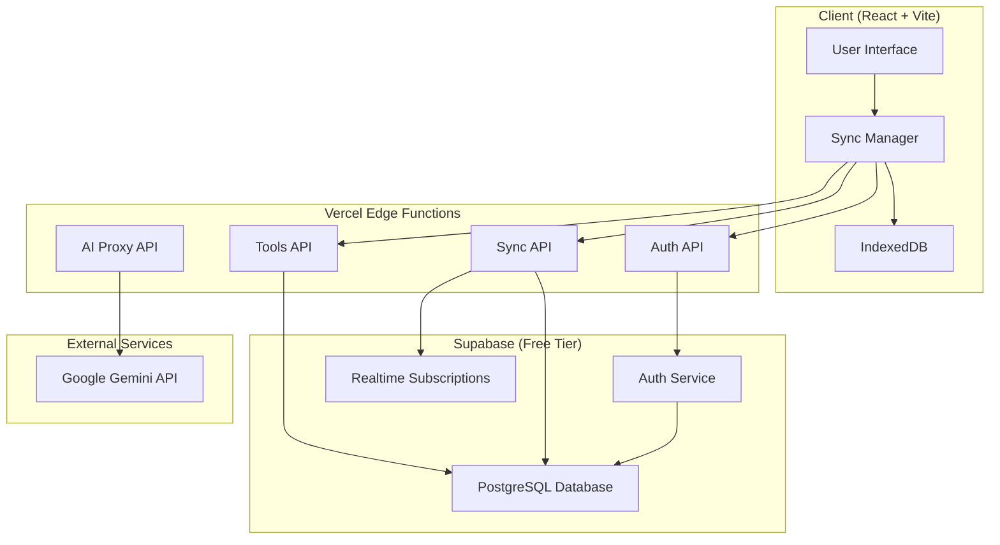

# Backend Integration Design Document

## Overview

This design transforms the current client-side Toolbox application into a full-stack application with proper backend infrastructure. The solution leverages free-tier services to maintain cost-effectiveness while providing enterprise-grade features including user authentication, data synchronization, secure API key management, and community tool sharing.

The architecture follows a hybrid approach where the application can function offline with local storage but synchronizes with the cloud when online, ensuring reliability and performance.

## Architecture

### High-Level Architecture



### Technology Stack

**Frontend (Existing)**
- React 19 with TypeScript
- Vite for build tooling
- IndexedDB for local storage
- TailwindCSS for styling

**Backend (New)**
- Vercel Edge Functions for serverless API endpoints
- Supabase for authentication and database
- PostgreSQL (via Supabase) for data persistence
- Supabase Realtime for live synchronization

**Free Tier Limits**
- Vercel: 100GB bandwidth, 1000 serverless function invocations per day
- Supabase: 500MB database, 50MB file storage, 2GB bandwidth per month
- Google Gemini: Generous free tier for API calls

## Components and Interfaces

### 1. Authentication System

**Supabase Auth Integration**
- Email/password authentication
- OAuth providers (Google, GitHub)
- JWT token management
- Session persistence

```typescript
interface AuthService {
  signUp(email: string, password: string): Promise<AuthResponse>
  signIn(email: string, password: string): Promise<AuthResponse>
  signInWithOAuth(provider: 'google' | 'github'): Promise<AuthResponse>
  signOut(): Promise<void>
  getCurrentUser(): Promise<User | null>
  onAuthStateChange(callback: (user: User | null) => void): () => void
}

interface User {
  id: string
  email: string
  created_at: string
  last_sign_in_at: string
}
```

### 2. Data Synchronization Layer

**Hybrid Storage Strategy**
- Primary: Local IndexedDB for immediate access
- Secondary: Cloud database for persistence and sync
- Conflict resolution for concurrent edits

```typescript
interface SyncManager {
  syncConversations(): Promise<void>
  syncUserTools(): Promise<void>
  syncAppState(): Promise<void>
  enableRealtime(): void
  disableRealtime(): void
  handleConflict(local: any, remote: any): any
}

interface SyncStatus {
  lastSync: Date
  pendingChanges: number
  isOnline: boolean
  isSyncing: boolean
}
```

### 3. API Layer (Vercel Functions)

**Authentication API** (`/api/auth/*`)
```typescript
// /api/auth/session
interface SessionResponse {
  user: User | null
  session: Session | null
}

// /api/auth/refresh
interface RefreshResponse {
  access_token: string
  refresh_token: string
}
```

**Tools API** (`/api/tools/*`)
```typescript
// /api/tools/user - Get user's private tools
// /api/tools/public - Get public community tools
// /api/tools/create - Create new tool
// /api/tools/update - Update existing tool
// /api/tools/delete - Delete tool
// /api/tools/publish - Make tool public
// /api/tools/unpublish - Make tool private

interface ToolAPI {
  getUserTools(userId: string): Promise<UserTool[]>
  getPublicTools(page?: number, limit?: number): Promise<PublicTool[]>
  createTool(tool: CreateToolRequest): Promise<UserTool>
  updateTool(toolId: string, updates: UpdateToolRequest): Promise<UserTool>
  deleteTool(toolId: string): Promise<void>
  publishTool(toolId: string): Promise<void>
  unpublishTool(toolId: string): Promise<void>
}
```

**AI Proxy API** (`/api/ai/*`)
```typescript
// /api/ai/generate-code
// /api/ai/generate-chat
// /api/ai/generate-images

interface AIProxyAPI {
  generateCode(request: CodeGenerationRequest): Promise<GeneratedCode>
  generateChat(request: ChatRequest): Promise<string>
  generateImages(request: ImageRequest): Promise<GeneratedImages>
}
```

**Sync API** (`/api/sync/*`)
```typescript
// /api/sync/conversations
// /api/sync/app-state

interface SyncAPI {
  syncConversations(userId: string, localData: Conversation[]): Promise<SyncResponse<Conversation>>
  syncAppState(userId: string, localState: AppState): Promise<SyncResponse<AppState>>
}

interface SyncResponse<T> {
  data: T[]
  conflicts: ConflictItem[]
  lastModified: Date
}
```

## Data Models

### Database Schema (PostgreSQL via Supabase)

```sql
-- Users table (managed by Supabase Auth)
-- auth.users is automatically created

-- User profiles
CREATE TABLE profiles (
  id UUID REFERENCES auth.users(id) PRIMARY KEY,
  email TEXT NOT NULL,
  display_name TEXT,
  avatar_url TEXT,
  created_at TIMESTAMP WITH TIME ZONE DEFAULT NOW(),
  updated_at TIMESTAMP WITH TIME ZONE DEFAULT NOW()
);

-- Conversations
CREATE TABLE conversations (
  id TEXT PRIMARY KEY,
  user_id UUID REFERENCES auth.users(id) NOT NULL,
  name TEXT NOT NULL,
  messages JSONB NOT NULL DEFAULT '[]',
  system_instruction TEXT,
  icon TEXT,
  convo_type TEXT DEFAULT 'builder',
  editing_tool_id TEXT,
  created_at TIMESTAMP WITH TIME ZONE DEFAULT NOW(),
  updated_at TIMESTAMP WITH TIME ZONE DEFAULT NOW()
);

-- User tools (private and public)
CREATE TABLE user_tools (
  id TEXT PRIMARY KEY,
  user_id UUID REFERENCES auth.users(id) NOT NULL,
  name TEXT NOT NULL,
  description TEXT,
  html TEXT NOT NULL,
  icon_name TEXT DEFAULT 'PuzzlePieceIcon',
  sub_type TEXT DEFAULT 'Utility',
  is_public BOOLEAN DEFAULT FALSE,
  uses INTEGER DEFAULT 0,
  likes INTEGER DEFAULT 0,
  created_at TIMESTAMP WITH TIME ZONE DEFAULT NOW(),
  updated_at TIMESTAMP WITH TIME ZONE DEFAULT NOW()
);

-- Tool usage tracking
CREATE TABLE tool_usage (
  id UUID DEFAULT gen_random_uuid() PRIMARY KEY,
  tool_id TEXT REFERENCES user_tools(id),
  user_id UUID REFERENCES auth.users(id),
  used_at TIMESTAMP WITH TIME ZONE DEFAULT NOW()
);

-- Tool likes
CREATE TABLE tool_likes (
  tool_id TEXT REFERENCES user_tools(id),
  user_id UUID REFERENCES auth.users(id),
  created_at TIMESTAMP WITH TIME ZONE DEFAULT NOW(),
  PRIMARY KEY (tool_id, user_id)
);

-- App state storage
CREATE TABLE app_state (
  user_id UUID REFERENCES auth.users(id),
  key TEXT,
  value JSONB,
  updated_at TIMESTAMP WITH TIME ZONE DEFAULT NOW(),
  PRIMARY KEY (user_id, key)
);

-- Indexes for performance
CREATE INDEX idx_conversations_user_id ON conversations(user_id);
CREATE INDEX idx_conversations_updated_at ON conversations(updated_at);
CREATE INDEX idx_user_tools_user_id ON user_tools(user_id);
CREATE INDEX idx_user_tools_public ON user_tools(is_public) WHERE is_public = TRUE;
CREATE INDEX idx_user_tools_updated_at ON user_tools(updated_at);
CREATE INDEX idx_tool_usage_tool_id ON tool_usage(tool_id);
CREATE INDEX idx_tool_usage_user_id ON tool_usage(user_id);
```

### TypeScript Interfaces

```typescript
interface DatabaseConversation {
  id: string
  user_id: string
  name: string
  messages: Message[]
  system_instruction?: string
  icon?: string
  convo_type: 'builder' | 'agent' | 'image-generator'
  editing_tool_id?: string
  created_at: string
  updated_at: string
}

interface DatabaseUserTool {
  id: string
  user_id: string
  name: string
  description: string
  html: string
  icon_name: string
  sub_type: string
  is_public: boolean
  uses: number
  likes: number
  created_at: string
  updated_at: string
}

interface PublicTool extends DatabaseUserTool {
  author_name: string
  author_avatar?: string
  is_liked_by_user: boolean
}
```

## Error Handling

### Client-Side Error Handling

```typescript
interface ErrorHandler {
  handleAuthError(error: AuthError): void
  handleSyncError(error: SyncError): void
  handleAPIError(error: APIError): void
  handleNetworkError(error: NetworkError): void
}

class GracefulDegradation {
  // Fall back to local storage when backend is unavailable
  static async withFallback<T>(
    cloudOperation: () => Promise<T>,
    localFallback: () => Promise<T>
  ): Promise<T> {
    try {
      return await cloudOperation()
    } catch (error) {
      console.warn('Cloud operation failed, falling back to local:', error)
      return await localFallback()
    }
  }
}
```

### Server-Side Error Handling

```typescript
// Vercel Function error handling
export default async function handler(req: Request): Promise<Response> {
  try {
    // API logic here
    return new Response(JSON.stringify(result), {
      status: 200,
      headers: { 'Content-Type': 'application/json' }
    })
  } catch (error) {
    console.error('API Error:', error)
    
    if (error instanceof AuthenticationError) {
      return new Response(JSON.stringify({ error: 'Unauthorized' }), {
        status: 401,
        headers: { 'Content-Type': 'application/json' }
      })
    }
    
    return new Response(JSON.stringify({ error: 'Internal Server Error' }), {
      status: 500,
      headers: { 'Content-Type': 'application/json' }
    })
  }
}
```

## Testing Strategy

### Unit Testing
- Test individual API functions
- Test data transformation utilities
- Test sync conflict resolution logic
- Test authentication flows

### Integration Testing
- Test API endpoints with real database
- Test authentication with Supabase
- Test data synchronization scenarios
- Test offline/online transitions

### End-to-End Testing
- Test complete user workflows
- Test tool creation and sharing
- Test cross-device synchronization
- Test graceful degradation scenarios

### Performance Testing
- Test API response times
- Test database query performance
- Test sync performance with large datasets
- Test concurrent user scenarios

## Security Considerations

### Authentication Security
- JWT tokens with appropriate expiration
- Secure HTTP-only cookies for refresh tokens
- CSRF protection for state-changing operations
- Rate limiting on authentication endpoints

### Data Security
- Row-level security (RLS) in Supabase
- Input validation and sanitization
- SQL injection prevention
- XSS protection for user-generated content

### API Security
- API key rotation strategy
- Request rate limiting
- CORS configuration
- Environment variable security

## Migration Strategy

### Phase 1: Backend Infrastructure
1. Set up Supabase project and database
2. Create Vercel API functions
3. Implement authentication system
4. Set up basic CRUD operations

### Phase 2: Data Migration
1. Create migration utilities
2. Implement data export from IndexedDB
3. Implement data import to cloud database
4. Add migration UI for users

### Phase 3: Sync Implementation
1. Implement hybrid storage layer
2. Add real-time synchronization
3. Implement conflict resolution
4. Add offline/online detection

### Phase 4: Community Features
1. Implement tool sharing functionality
2. Add public tool marketplace
3. Implement rating and usage tracking
4. Add tool discovery features

## Performance Optimization

### Client-Side Optimizations
- Lazy loading of non-critical data
- Debounced sync operations
- Optimistic UI updates
- Background synchronization

### Server-Side Optimizations
- Database query optimization
- Connection pooling
- Caching strategies
- Edge function optimization

### Network Optimizations
- Request batching
- Compression
- CDN utilization
- Progressive data loading